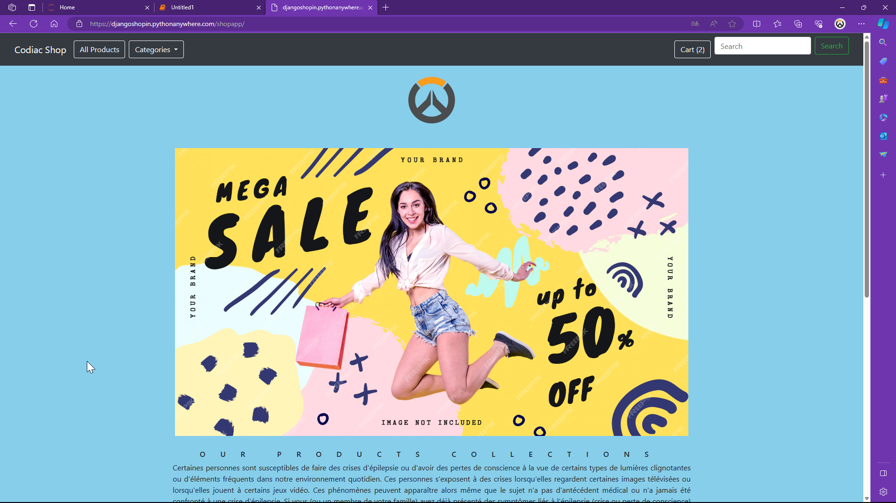
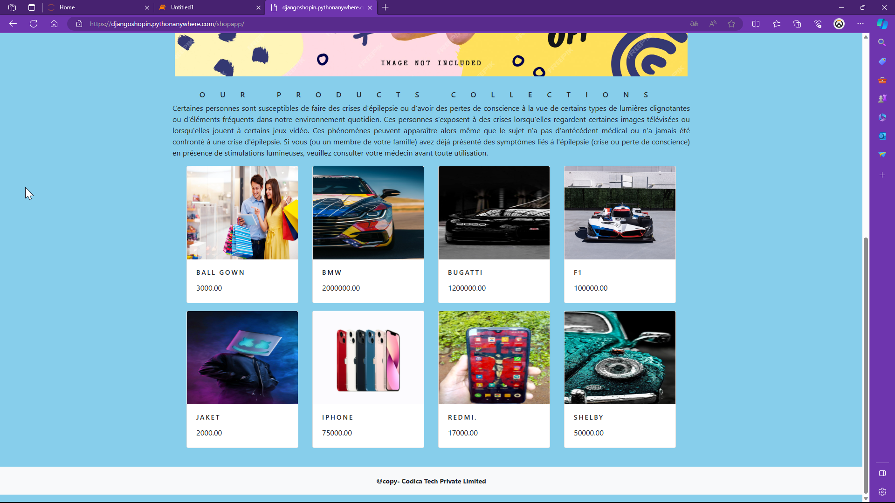
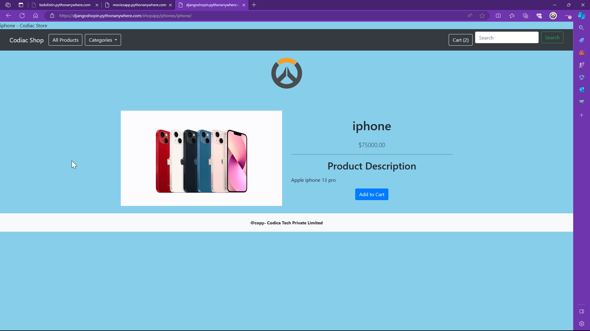
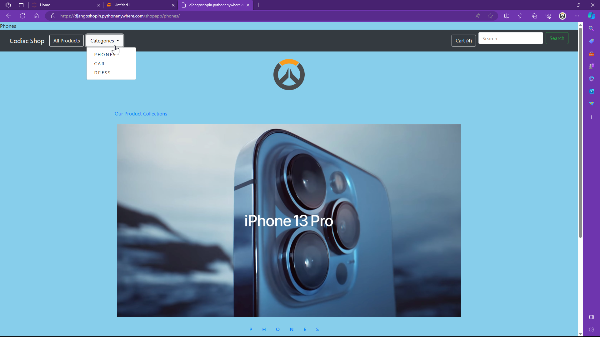
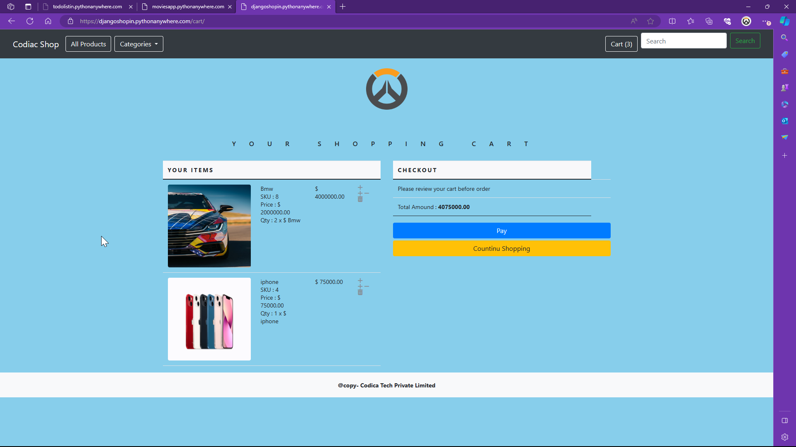

python anywhere : https://djangoshopin.pythonanywhere.com/shopapp/    
(valid until july 2024)

# Codiac Shop: A Feature-Rich E-Commerce Django Project
This is a E-commerce website built with Django,Python,HTML,CSS,Bootstrap & Javascript 

Codiac Shop is a robust e-commerce platform built using Django that empowers you to establish a flourishing online store. It offers a user-friendly interface for both customers and administrators, enabling seamless product browsing, cart management, and checkout processes.

Key Features:

Multiple Apps for Modular Organization:
cart: Efficiently handles shopping cart functionality, including adding, removing, and updating cart items.
shopapp: Core application for managing products, categories, and product details.
search: Implements a search bar to allow customers to effortlessly find products based on name or description.

ShopApp Views:

allProdCat: Dynamically displays products based on selected categories, providing a structured browsing experience.
proDetail: Presents detailed information about individual products, including images and descriptions.

Context Processors:

menu_links: Renders a menu on the storefront, dynamically populating category links for easy navigation.
counter: Keeps track of the total number of items in the customer's cart, providing a visual indicator.

Cart Views:

_cart_id: Handles session management for carts, ensuring each user has a unique cart.
add_cart: Adds products to the customer's cart, taking into account stock availability.
cart_detail: Displays the contents of the cart, including product details, quantities, and total cost.
cart_remove: Allows customers to remove items from their cart, either partially or completely.
delete: Permanently removes an item from the customer's cart.

Installation Guide:

Prerequisites: Ensure you have Python (version 3.6 or later) and pip (package installer) installed.
Clone the Repository: Use git clone https://github.com/your-username/codiac-shop.git to clone the project.
Create a Virtual Environment (Recommended):
Create a virtual environment using python3 -m venv venv.
Activate the environment using source venv/bin/activate (Linux/macOS) or venv\Scripts\activate (Windows).
Install Dependencies: Run pip install -r requirements.txt to install the required Python packages.

Database Setup:

Configure your database settings (e.g., MySQL, PostgreSQL) in codiac_shop/settings.py.
Create the database tables using python manage.py migrate.
Run the Development Server: Start the development server with python manage.py runserver.

Customization:

Codiac Shop provides a solid foundation for your e-commerce needs. You can customize it further by:

Adding new product categories and attributes.
Implementing more complex search functionalities.
Integrating with payment gateways.
Enhancing the user interface and user experience.

Contribution:

We welcome contributions to the Codiac Shop project! Feel free to fork the repository, make changes, and submit pull requests.
